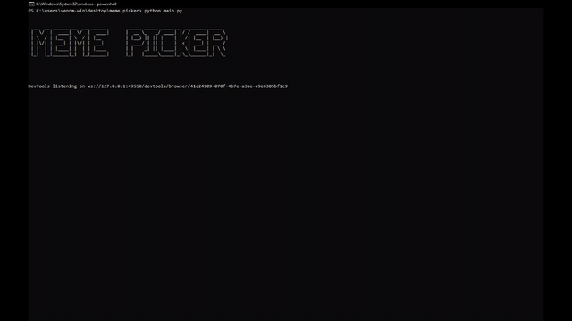

<h1>MEME PICKER</h1>
<p> MEME PICKER is an software developed on Python, and it is used for 
taking memes images, videos, gif files from the web sites like</p>
	- 9gag.com
	- memedroid.com

	
# HOW IT WORKS
	- [1] MEME PICKER visits the declared web sites from the static.py
	- [2] Then starts the file extraction process with XPATH 
	- [3] After extraction , we download files from the url
	- [4] At the same time split the url on the last dot '.'  which is the separator for the extension, to get file real name.
	- [5] UPLOAD file address to the mysql database, which gives posibility in the future to use those image, video, and gif files  on the web site
# CROSS PLATFORM
 <h2> LINUX </h2>
  in the browser.py uncomment line 35 and set the comment on the 32 line
 <h2> Windows <h2>
  in the  browser.py  add comment on the 35 line and uncomment 32 line 

# REQUIREMENTS
 - Python3  
 - Requests
 - Selenium
 - TQDM

# INSTALLATION
  - [1] ``` pip3 install requests ```
  - [2] ``` pip3 install selenium ```
  - [3] ``` pip3 install tqdm ```

